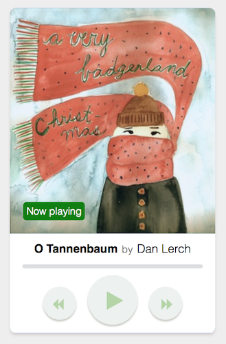

react-music-player
=================

> A simple audio player written in ReactJS



## Install

```sh
$ npm install
# install all the packages locally
```

## Build

Bundling the javascript using webpack

```sh
$ webpack -d
# -d switch bundles in dev mode
```

If you don't want to compile after every change, use the following

```sh
$ webpack --progress --colors --watch
```

Compiling sass to css

```sh
$ npm start
# with npm you can run tasks defined in package.json
``` 

```
Music courtesy : http://freemusicarchive.org
All credits belong to the artists
```
